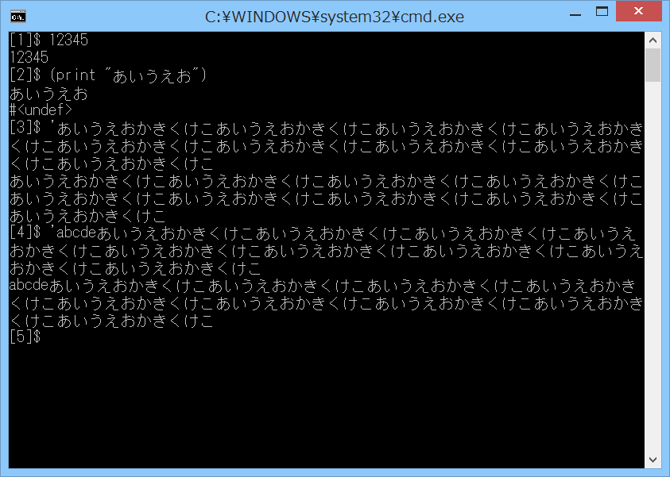

# line-editor-gw

## 概要
- Gauche の line-editor サンプルを、Windowsのコンソール用に改造したものです。  
  実行には Gauche v0.9.5_pre1 が必要です。  
  また、改造版のモジュールをいくつか使用しています。

## 実行方法
- line-editor-gw.bat をダブルクリック等で起動します。  
  (本サイトのファイル一式が同一フォルダに存在する必要があります)  
  あとは通常の Gauche の REPL と同じです。  
  (カーソル上下によるヒストリ機能や、Emacsライクなキーバインドがいくつか、  
   使用可能になっています)  

## 変更点
- オリジナルからの変更点を以下に示します。

1. 入力のエコーではなくREPLとして機能するように変更
2. 起動時の引数により、SJISとUTF-8の入出力に対応
3. モジュールの改造(line-edit, console)
   - ワイド文字対応(不完全)
   - 再表示関数(redisplay)の処理変更
   - 複数行入力してカーソルを先頭に戻してEnterキーを押すと、  
     2行目以降がエコーバックに消される件の対策
   - 漢字を入力しようとして Alt+半角/全角キーを押すと終了する件の対策  
     (Alt+nullキーにダミーコマンドを設定)
   - 端を越えてカーソル移動しようとするとマークが外れる件の対策
   - 複数行入力時のカーソル上下移動でマークが外れる件の対策
   - 複数行入力時の複数行のリージョン選択で、第2プロンプトも選択状態になる件の対策
   - Ctrl+l キーによる再表示で、表示が右にずれていく件の対策
   - Home/Endキーを押すとエラーになる件の対策
   - 文字列の貼り付け(ペースト)の高速化
   - MS-IMEがONのときのスクロール表示の不具合対応
   - サロゲートペアの文字の入力に対応
   - カーソル位置取得(query-cursor-position)の処理変更
4. MSYS2のmintty上での表示に暫定対応(実験中)
5. MSYS2のmintty上でwinpty使用時の表示に暫定対応(実験中)

## 注意事項
1. 1文字入力するごとに消去と再表示をしているため、入力文字数が多くなると、  
   ちらつきや遅延が発生します。
2. コマンドプロンプトで、バッファの最終行 (デフォルトでは300行) に文字を表示した  
   状態で、MS-IMEをONにすると、最終行に MS-IME の状態 (「全あ般ローマ」等) が  
   表示されて、全体の表示が1行上にスクロールします。  
   そして、このときに何か不具合が生じているらしく、さらに最終行に文字を表示すると、  
   表示が乱れたり、エラーが発生したりします。  
   この現象を回避するため、console モジュールだけでなく、line-edit モジュール  
   の方にも、対策用のコード(1行余分にスクロールして最終行を空ける等)を入れています。  
   しかし、まだ最終行に変な表示が残ったりするようです。  
   (MS-IMEによる日本語入力を使わなければ、本問題は発生しません)  
   (対策用コードのところには「for windows ime bug」というコメントを入れています)

## 要調査事項
1. mintty上で、Ctrl+矢印キー 等で、変な文字が入力される  
   → 保留 (割り当てを増やせば対応できそうだが。。。)
2. mintty上で、矢印キーの上とEnterキーを交互に素早く押すと、「terminal error」が出る  
   → 完了 (カーソル位置取得の処理を変更)
3. mintty上で、入力がエコーバックされたり、入力が消えたりする  
   → 修正 (サンプルプログラム側で、メイン処理を call-with-console で囲って、常にエコーなし  
   にした。また、カーソル位置取得中に受信した文字を、捨てないでキューイングするようにした)  
   → 完了 (上記でエコーなしにしたため、REPL 上で read-line 等を実行すると、入力が見えなく  
   なった。このため、REPL の evaluator の実行時だけは、エコーありにした)
4. mintty上で、画面サイズを超える複数行を入力すると、カーソル移動がおかしくなる  
   → 完了 (画面表示のクリッピング処理を追加した)
5. カーソルの座標が、Windowsコンソールではバッファの先頭が原点(0,0)となっているが、  
   minttyでは画面の左上が原点(0,0)となっている  
   → 保留 (これはどうにも。。。)

## 環境等
- OS
  - Windows 8.1 (64bit)
- 言語
  - Gauche v0.9.5_pre1
- ライセンス
  - オリジナルと同様とします

## 履歴
- 2015-11-23 v1.00 初版
- 2015-11-24 v1.01 コンソールバッファの最終行の処理修正(不完全)
- 2015-11-24 v1.02 一部処理見直し(redisplay)
- 2015-11-24 v1.03 改行入力時の第2プロンプト表示に対応
- 2015-11-27 v1.04 REPLのreaderの処理見直し
- 2015-12-4  v1.05 REPLでgauche.interactiveの機能を使用可能にした
- 2015-12-13 v1.06 文字列の貼り付け(ペースト)の高速化
- 2015-12-13 v1.07 行継続後の折り返し処理のバグ修正
- 2016-1-17  v1.08 コメント修正のみ
- 2016-2-27  v2.00 msjis以外の独自モジュールを削除して標準モジュールに変更
- 2016-2-27  v2.01 標準モジュールを改造(実験中)
- 2016-2-29  v2.02 Windowsコンソールでサロゲートペアの入力に対応。その他デバッグ等
- 2016-3-1   v2.03 デバッグ等
- 2016-3-1   v2.04 デバッグ等
- 2016-3-1   v2.05 デバッグ等
- 2016-3-2   v2.06 デバッグ等
- 2016-3-2   v2.07 デバッグ等
- 2016-3-4   v2.10 デバッグ等
- 2016-3-7   v2.20 termios の without-echoing の mintty 対応等
- 2016-3-9   v2.30 デバッグ等
- 2016-3-9   v2.40 デバッグ等
- 2016-3-10  v2.41 デバッグ等
- 2016-3-10  v2.42 標準モジュールの更新に追従(console.scm)

(2016-3-10)
