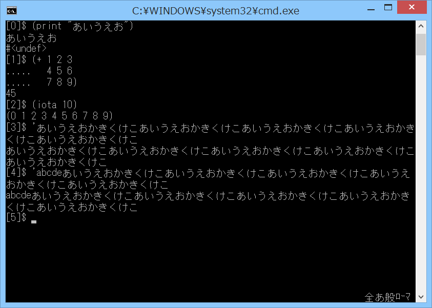

# line-editor-gw

## 概要
- Gauche の line-editor サンプルを、Windowsのコンソール用に改造したものです。  
  実行には Gauche v0.9.5_pre1 が必要です。  
  また、内部でいくつかの独自モジュールを使用しています。

## 実行方法
- line-editor-gw.bat をダブルクリック等で起動します。  
  (line-editor-gw.bat, line-editor-gw.scm, line-edit.scm(改),  
   mscon.scm, mscontext.scm, msjis.scm が同一フォルダに存在する必要があります)  
  あとは通常の Gauche の REPL と同じです。  
  (カーソル上下によるヒストリ機能や、Emacsライクなキーバインドがいくつか、  
   使用可能になっています)  

## 変更点
- オリジナルからの変更点を以下に示します。

1. Windowsのコンソール用に使用モジュールを変更
2. 入力のエコーではなくREPLとして機能するように変更
3. 起動時の引数により、SJISとUTF-8の入出力に対応
4. line-editモジュールの変更
   - ワイド文字対応(不完全)
   - 再表示関数(redisplay)の処理変更
   - 複数行入力してカーソルを先頭に戻してEnterキーを押すと、  
     2行目以降がエコーバックに消される件の対策
   - 漢字を入力しようとして Alt+半角/全角キーを押すと終了する件の対策  
     (Alt+nullキーにダミーコマンドを設定)
   - Ctrl+Spaceキーでマークセットするように設定
   - 端を越えてカーソル移動しようとするとマークが外れる件の対策

## その他 問題点等
1. MS-IMEをONにして、コンソールバッファの最終行で、ヒストリで文字を複数行  
   入力すると、表示がおかしくなる場合があります(一部の行が消える等)。  
   どうもコンソールバッファの最終行と、MS-IMEの状態表示とで、バッファを  
   共有していて、その競合によっておかしくなるもよう。  
   MS-IMEをOFFにすると、この問題は発生しません。
2. 1文字入力するごとに消去と再表示をしているため、入力文字数が多くなると、  
   ちらつきや遅延が発生します。

## 環境等
- OS
  - Windows 8.1 (64bit)
- 言語
  - Gauche v0.9.5_pre1
- ライセンス
  - オリジナルと同様とします

## 履歴
- 2015-11-23 v1.00 初版
- 2015-11-24 v1.01 コンソールバッファの最終行の処理修正(不完全)
- 2015-11-24 v1.02 一部処理見直し(redisplay)
- 2015-11-24 v1.03 改行入力時の第2プロンプト表示に対応
- 2015-11-27 v1.04 REPLのreaderの処理見直し

(2015-11-27)
